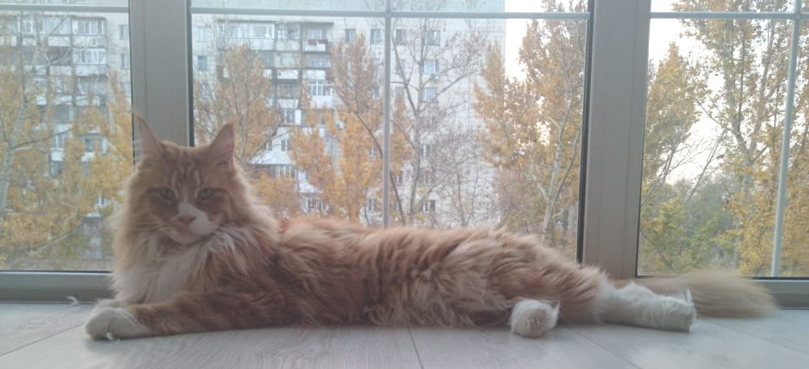

---
# Display name
name: Барон

# Username (this should match the folder name)
authors:
- cat-baron

weight: 30

# Is this the primary user of the site?
superuser: false

# Role/position
role: "Талисман котокафе"

# Organizations/Affiliations
organizations: []

# Short bio (displayed in user profile at end of posts)
bio: ""

interests:
- Бегать с мячиком
- Сидеть на ручках и болтать
- Смотреть в окно

# education:
#  courses: []

# social:
# - icon: instagram
#  icon_pack: fab
#  link: "https://www.instagram.com/kotokafe_karaganda/"

# Enter email to display Gravatar (if Gravatar enabled in Config)
email: ""

# Organizational groups that you belong to (for People widget)
#   Set this to `[]` or comment out if you are not using People widget.
user_groups:
- "Хвостосотрудники"

---

Чистокровный мейн-кун, с документами от заводчика. Купленный за немалые деньги и оказавшийся ненужным хозяином, как, увы, и сотни других животных даже самых редких и дорогих пород. Барон – яркий пример того, что порода не защищает от ненужности.

А еще Барон неизлечимо болен. У него дисплазия суставов. Именно поэтому сейчас он живет в приёмной семье, а к нам приходит только в гости. Такое генетическое заболевание у котов чаще всего – результат смешения родственной крови, безответственность разведенцев – ещё одна очень больная тема для зоозащитников. 

Лечение и содержание Барона очень затратно. Но любовь и забота дали ему все шансы на долгую и счастливую жизнь.

