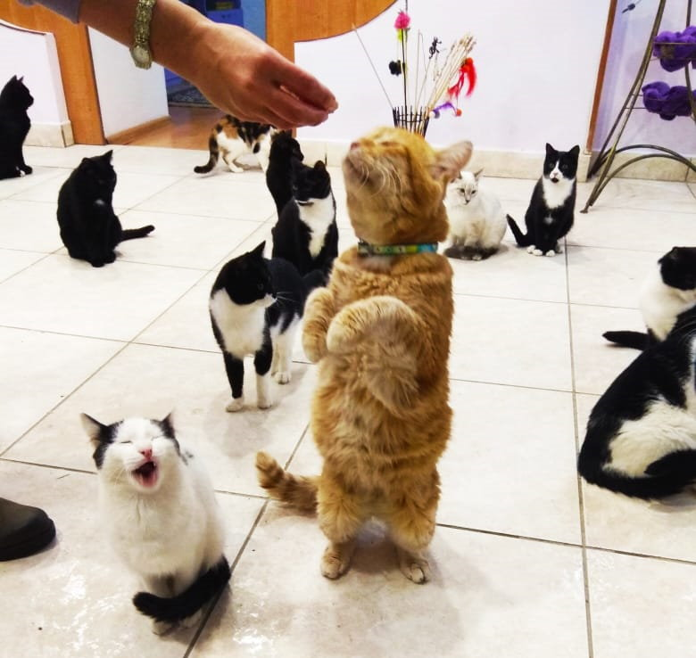

---
# Display name
name: Борис

# Username (this should match the folder name)
authors:
- cat-boris

weight: 50

# Is this the primary user of the site?
superuser: false

# Role/position
role: "Игривый добряк"

# Organizations/Affiliations
organizations: []

# Short bio (displayed in user profile at end of posts)
bio: ""

interests:
- Игры (желательно лёжа)
- Усиленное питание
- Ветеринар Настя

# education:
#  courses: []

# social:
# - icon: instagram
#  icon_pack: fab
#  link: "https://www.instagram.com/kotokafe_karaganda/"

# Enter email to display Gravatar (if Gravatar enabled in Config)
email: ""

# Organizational groups that you belong to (for People widget)
#   Set this to `[]` or comment out if you are not using People widget.
user_groups:
- "Хвостосотрудники"

---

Толстяк и добряк примерно 5-6 лет. Что бы ни происходило вокруг, оно должно быть под его неусыпным контролем. Осознавая свои габариты, Борис предпочитает заправляться из мисок [Смайла](/authors/dog-smile/). Упитанное пузико совсем не мешает любви Бориса к играм и развлечениям. Если где-то весело запрыгал лазерный лучик или ленточки-дразнилки, Боря – первый участник. 

А недавно влюбился в нашего ветеринара Анастасию. Теперь он сопровждает её повсюду и с грустью ждёт под дверью, когда она принимает пациентов. 

Борису досталось во время скитаний на улицах. Мы долго лечили бродягу. Но верим, что впереди у него счастливая жизнь.

