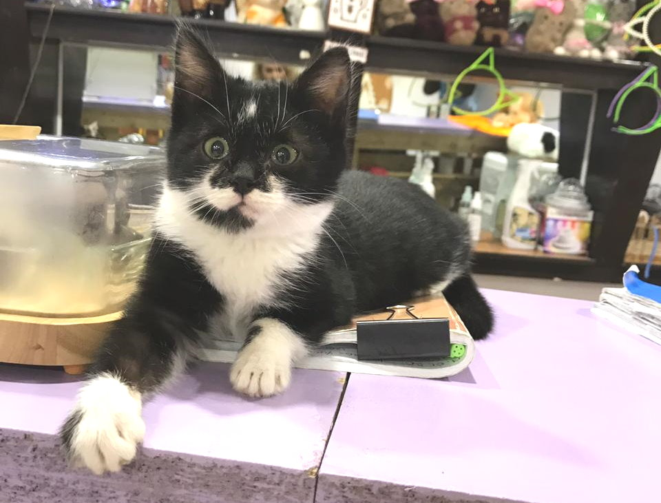

---
# Display name
name: Кузя Пуговкин

# Username (this should match the folder name)
authors:
- cat-kuzya-pugovkin

weight: 40

# Is this the primary user of the site?
superuser: false

# Role/position
role: "Мелкий шкодник"

# Organizations/Affiliations
organizations: []

# Short bio (displayed in user profile at end of posts)
bio: ""

interests:
- Сидеть на ручках
- Играть в прятки
- Донимать щенков

# education:
#  courses: []

# social:
# - icon: instagram
#  icon_pack: fab
#  link: "https://www.instagram.com/kotokafe_karaganda/"

# Enter email to display Gravatar (if Gravatar enabled in Config)
email: ""

# Organizational groups that you belong to (for People widget)
#   Set this to `[]` or comment out if you are not using People widget.
user_groups:
- "Хвостосотрудники"

---

Яркий представитель неугомонной кошачей малышни. Встроенный моторчик заводится как только берёшь на ручки. Переход из режима “здоровый крепкий сон” в режим “давайте поиграем” – мгновенный. Любознателен и бесстрашен. Всегда готов съесть что-нибудь вкусное и утащить что-нибудь мелкое. 

Кузя – выпускник нашего “котосадика”. Это отдельный маленький карантин, где спасаем с улицы больных, поколеченных и простывших малышей. Большинство из тех, кому посчастливилось справиться с бедой и выжить, уезжают по домам сразу из “котосадика”. А те, кто остаются, подрастая, становятся полноценными котосотрудниками и продолжают ждать свою семью.

