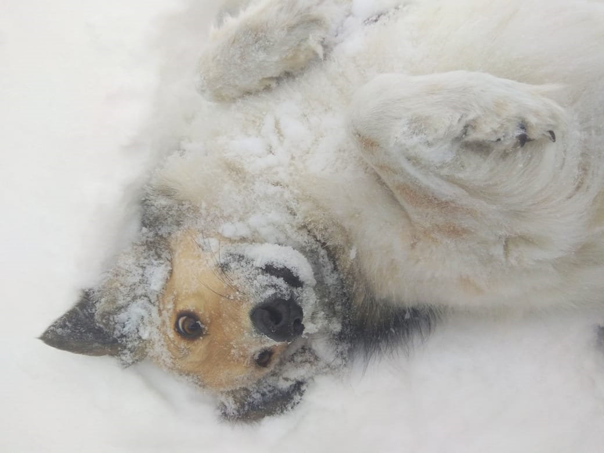

---
# Display name
name: Смайл

# Username (this should match the folder name)
authors:
- dog-smile

weight: 20

# Is this the primary user of the site?
superuser: false

# Role/position
role: "Улыбчивый котохранитель"

# Organizations/Affiliations
organizations: []

# Short bio (displayed in user profile at end of posts)
bio: ""

interests:
- Валяние в снегу
- Куриные шейки
- Чесание за ушами

# education:
#  courses: []

# social:
# - icon: instagram
#  icon_pack: fab
#  link: "https://www.instagram.com/kotokafe_karaganda/"

# Enter email to display Gravatar (if Gravatar enabled in Config)
email: ""

# Organizational groups that you belong to (for People widget)
#   Set this to `[]` or comment out if you are not using People widget.
user_groups:
- "Хвостосотрудники"

---

Смайл попал к волонтерам в ноябре 2017 года после автомобильной аварии. Лишившись задних лап, пережив предательство хозяев, он остался добрым и ласковым “медведем”, любимцем детей и взрослых. А беды, выпавшие на его лохматую голову, сделали Смайла настоящим символом твердости духа и любви к жизни.

Некоторые истории из жизни Смайла:

* [Ветеринары из Караганды впервые сделали собаке титановую лапу](http://bigasia.ru/content/news/eco/veterinary-iz-karagandy-vpervye-sdelali-sobake-titanovuyu-lapu/)  
  *Новость на портале BigAsia*
* [Пропажа Смайла и история его спасения](https://www.instagram.com/p/Bvnv3G2hHDp/)  
  *Хронология реальных событий*
* [История Смайла. Начало.](https://www.instagram.com/p/B7tg3V_Brdc/)  
  *Рассказ, вошедший в литературный сборник “Мы за них в ответе”.*

